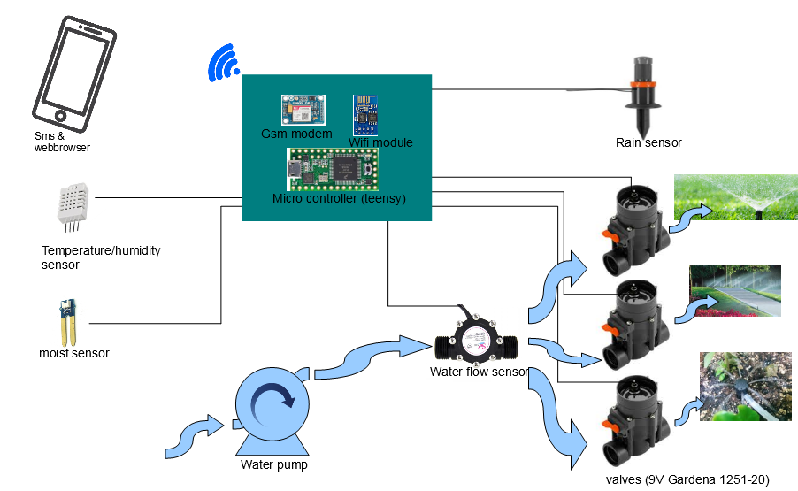
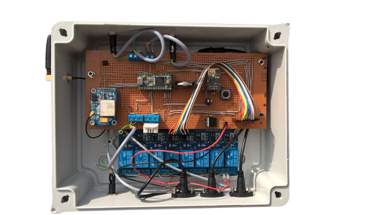

# Gardena
Gardena Watering System control via SMS and/or web interface
 
 Here some slides: 
https://github.com/maroprjs/Gardena/blob/master/libs/GardenaLibrary/docs/GardenaWateringSytemWithTeensy.pdf 
https://github.com/maroprjs/Gardena/blob/master/libs/GardenaLibrary/docs/commands.txt 
 
 Prototype based on mechanical relays: 
 
